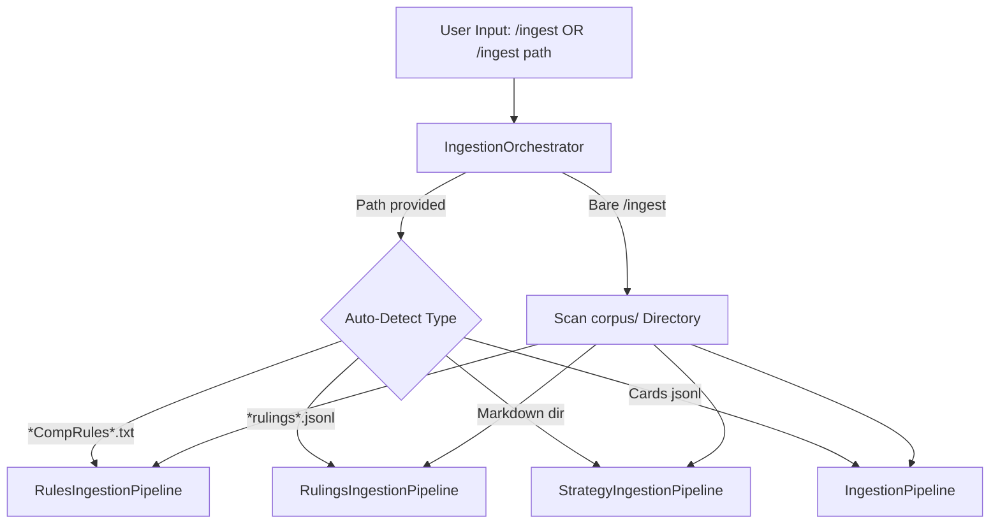

# Implementation Plan: Unified Ingestion Orchestrator & Auto-Detection

## 1. Executive Summary & Objective

LexiGrim has separate ingestion pipelines for cards (`[`IngestionPipeline`](ingestion/pipeline.py:46)` in [`ingestion/pipeline.py`](ingestion/pipeline.py:1)), rules (`[`RulesIngestionPipeline`](ingestion/pipelines/rules_pipeline.py:16)` in [`ingestion/pipelines/rules_pipeline.py`](ingestion/pipelines/rules_pipeline.py:1)), rulings (`[`RulingsIngestionPipeline`](ingestion/pipelines/rulings_pipeline.py:1)` in [`ingestion/pipelines/rulings_pipeline.py`](ingestion/pipelines/rulings_pipeline.py:1)), and strategy (`[`StrategyIngestionPipeline`](ingestion/pipelines/strategy_pipeline.py:1)` in [`ingestion/pipelines/strategy_pipeline.py`](ingestion/pipelines/strategy_pipeline.py:1)). 

To unify ingestion under the interactive CLI and CLI arguments:
1. **Corpus Auto-Detection (`/ingest <path>`)**: When the user provides a path to `/ingest`, the system inspects the file/directory name and structure to automatically select and run the correct ingestion pipeline.
2. **Auto-Discovery & Full Ingestion (Bare `/ingest`)**: When a bare `/ingest` with no filename is invoked in the interactive CLI, the system automatically discovers all available corpus files/directories in [`corpus/`](corpus/) and executes them sequentially.

---

## 2. Architecture & Design

### 2.1 The `IngestionOrchestrator` (`ingestion/orchestrator.py`)
We create [`ingestion/orchestrator.py`](ingestion/orchestrator.py:1) containing `[`IngestionOrchestrator`](ingestion/orchestrator.py:1)`:
- **`detect_and_run(path: str, progress_callback=None)`**:
  - Inspects `path`.
  - If `path` contains `CompRules` or ends with `.txt`: invokes [`RulesIngestionPipeline`](ingestion/pipelines/rules_pipeline.py:16).
  - If `path` contains `rulings`: invokes [`RulingsIngestionPipeline`](ingestion/pipelines/rulings_pipeline.py:1).
  - If `path` is a directory or contains strategy markdown: invokes [`StrategyIngestionPipeline`](ingestion/pipelines/strategy_pipeline.py:1).
  - Otherwise defaults to [`IngestionPipeline`](ingestion/pipeline.py:46) (card corpus).
- **`run_all(corpus_dir: str = "corpus", progress_callback=None)`**:
  - Scans `corpus_dir` for standard files (`MagicCompRules*.txt`, card jsonl, rulings jsonl, strategy files).
  - Executes them sequentially in correct order.

### 2.2 Integration into Session Controller & CLI Shell
- Update [`LexiGrimSession.trigger_background_ingestion()`](ui/controller.py:60) in [`ui/controller.py`](ui/controller.py:1) to delegate to `IngestionOrchestrator` (accepting optional path; if path is empty/None, calls `run_all`).
- Update [`InteractiveCLIShell.handle_user_input()`](ui/cli/app.py:110) in [`ui/cli/app.py`](ui/cli/app.py:1) to handle `/ingest` (bare or with path).

---

## 3. Step-by-Step Implementation Steps

1. **Implement [`ingestion/orchestrator.py`](ingestion/orchestrator.py:1)**:
   - Define type detection heuristics and pipeline delegation.
   - Support progress callbacks compatible with background thread reporting.
2. **Update [`ui/controller.py`](ui/controller.py:1)**:
   - Integrate `IngestionOrchestrator` into [`LexiGrimSession`](ui/controller.py:10).
3. **Update [`ui/cli/app.py`](ui/cli/app.py:1)**:
   - Support bare `/ingest` for full automatic corpus parsing, and `/ingest <path>` for targeted ingestion.
4. **Write Unit Tests**:
   - Add comprehensive tests in [`tests/test_orchestrator.py`](tests/test_orchestrator.py:1) verifying auto-detection and auto-discovery.
