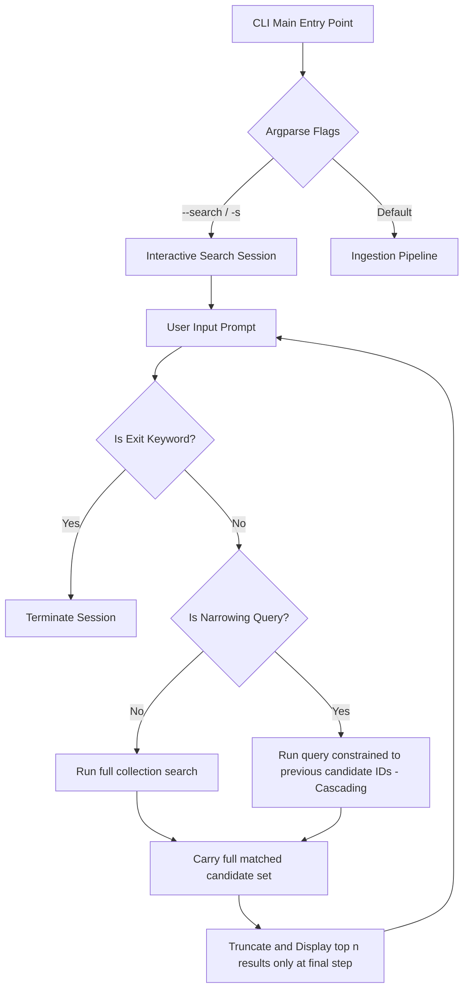

# Implementation Plan: Interactive Search & Search Narrowing

## Overview
This plan outlines the architecture for adding interactive search, configurable result display limits ($n$), and search narrowing within [`search.py`](search.py) and [`main.py`](main.py), adhering to the core principle: **"Carry the full value until the final display operation (do rounding/truncation last)."**

---

## 1. Core Architectural Principle: No Premature Truncation & Cascading vs. Multi-Query

- **Cascading Query Filtering (Sub-search)**: Used for interactive search narrowing. Step 1 searches the database; Step 2 searches *within* the valid candidate IDs from Step 1. This preserves all qualifying candidates (carrying the full value) without arbitrary top-$x$ truncation.
- **Multi-Query Fusion (Stubbed for Future)**: Reserved for simultaneous multi-intent single-prompt searches (e.g. splitting "creature that draws cards and gains life" into parallel vector queries combined via Reciprocal Rank Fusion). A stub method `multi_query_fusion()` with explanatory documentation will be included in [`search.py`](search.py) for future extensibility.

---

## 2. Modular Search API in [`search.py`](search.py)

- [`vector_search(query_text: str, limit: int = None, query_filter: models.Filter = None, candidate_ids: list[str] = None) -> list`](search.py:17):
  - Supports filtering by `candidate_ids` using Qdrant [`models.HasIdCondition(ids=candidate_ids)`](search.py:3) for cascading narrowing.
- `multi_query_fusion(queries: list[str], limit: int = 5) -> list`:
  - **No-op / Stub method**: Reserved for future multi-intent fusion search as discussed in architectural reviews.

---

## 3. CLI Integration in [`main.py`](main.py)

- `-s` / `--search`: Activates interactive search loop.
- `--results n` / `--r n`: Sets the final display limit ($n$, default: `3`).

---

## 4. Architecture Diagram

---

## 5. Implementation Steps

1. Refine [`search.py`](search.py) to support cascading ID filters, interactive session loop, and the `multi_query_fusion` stub with explanatory rationale.
2. Update [`main.py`](main.py) to support `-s` / `--search` and `--results` / `--r` flags.
3. Verify interactive search and narrowing workflows.
