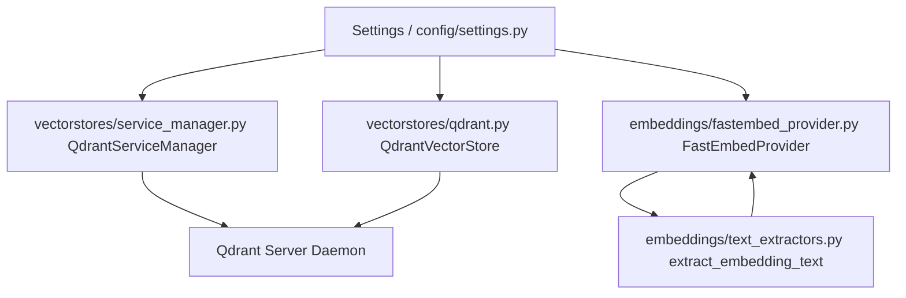

# Phase 2: Storage & Embedding Abstractions Implementation Plan

This implementation plan covers **Phase 2** of the MTG Expert codebase refactor, derived from [`docs/MTG Expert Codebase Comprehensive Code Review.md`](docs/MTG%20Expert%20Codebase%20Comprehensive%20Code%20Review.md:1) and operating in full cohesion with [`docs/plans/phase_1_foundation_and_core.md`](docs/plans/phase_1_foundation_and_core.md:1).

---

## 1. Objectives & Scope

1. **Abstract Embedding Interface & Provider (`embeddings/`)**:
   - [`embeddings/base.py`](embeddings/base.py): Define [`BaseEmbeddingService`](embeddings/base.py:5) abstract class with `@property def dimension` and methods [`embed_documents()`](embeddings/base.py:12) and [`embed_query()`](embeddings/base.py:17).
   - [`embeddings/fastembed_provider.py`](embeddings/fastembed_provider.py): Implement [`FastEmbedProvider`](embeddings/fastembed_provider.py:6) extending [`BaseEmbeddingService`](embeddings/base.py:5). Incorporate thread-safe bounded embedding cache using [`collections.OrderedDict`](embeddings/fastembed_provider.py:10) and [`threading.Lock`](embeddings/fastembed_provider.py:11) bounded to [`Settings.EMBEDDING_CACHE_SIZE`](config/settings.py:1). Ensure lazy initialization of [`TextEmbedding`](embeddings/fastembed_provider.py:15) to eliminate import-time side-effects.
   - [`embeddings/text_extractors.py`](embeddings/text_extractors.py): Centralize card payload filtering ([`extract_clean_payload()`](embeddings/text_extractors.py:5)) and text formatting ([`extract_embedding_text()`](embeddings/text_extractors.py:25)), correctly parsing single and double-faced ([`"card_faces"`](embeddings/text_extractors.py:30)) cards.

2. **Abstract Vector Store & Qdrant Implementation (`storage/`)**:
   - [`vectorstores/base.py`](vectorstores/base.py): Define [`BaseVectorStore`](vectorstores/base.py:5) abstract class defining [`initialize_schema()`](vectorstores/base.py:8), [`upsert_batch()`](vectorstores/base.py:12), [`search()`](vectorstores/base.py:16), [`get_existing_ids()`](vectorstores/base.py:24), and [`set_bulk_mode()`](vectorstores/base.py:28).
   - [`vectorstores/qdrant.py`](vectorstores/qdrant.py): Implement [`QdrantVectorStore`](vectorstores/qdrant.py:6) extending [`BaseVectorStore`](vectorstores/base.py:5). Wraps [`qdrant_client.QdrantClient`](vectorstores/qdrant.py:10). Provides parameterized page scroll (using 10,000 limit for ID-only fetching), schema creation, indexing thresholds, and robust retry logic with exponential backoff.

3. **Cross-Platform Service Lifecycle Manager (`vectorstores/service_manager.py`)**:
   - [`vectorstores/service_manager.py`](vectorstores/service_manager.py): Refactor [`qdrant_manager.py`](qdrant_manager.py:1) into an object-oriented, OS-agnostic [`QdrantServiceManager`](vectorstores/service_manager.py:6).
   - Replace hardcoded path `C:\Users\Admin\qdrant\qdrant.exe` with settings check ([`Settings.QDRANT_EXE_PATH`](config/settings.py:1)), [`QDRANT_BIN`](config/settings.py:1) env var, or [`shutil.which("qdrant")`](config/settings.py:1).
   - Conditionally apply Windows-specific subprocess flags ([`startupinfo`](vectorstores/service_manager.py:35), [`CREATE_NEW_PROCESS_GROUP`](vectorstores/service_manager.py:38)) only when `sys.platform == "win32"`.
   - Ensure [`ensure_qdrant_running()`](vectorstores/service_manager.py:25) is an instance method, NOT executed at import time.

---

## 2. Architecture & Workflow Diagram



---

## 3. Step-by-Step Implementation Steps

### Step 1: Implement Abstract Embedding Interface (`embeddings/base.py`)
Create [`embeddings/base.py`](embeddings/base.py) defining the abstract contract for all embedding providers.

#### Exact Code Structure for [`embeddings/base.py`](embeddings/base.py)
```python
from abc import ABC, abstractmethod
from typing import List

class BaseEmbeddingService(ABC):
    """Abstract base class for text embedding providers."""

    @property
    @abstractmethod
    def dimension(self) -> int:
        """Return vector embedding dimension."""
        pass

    @abstractmethod
    def embed_documents(self, texts: List[str]) -> List[List[float]]:
        """Embed a batch of document texts for vector indexing."""
        pass

    @abstractmethod
    def embed_query(self, query: str) -> List[float]:
        """Embed a single search query string."""
        pass
```

---

### Step 2: Implement FastEmbed Provider (`embeddings/fastembed_provider.py`)
Create [`embeddings/fastembed_provider.py`](embeddings/fastembed_provider.py) implementing [`BaseEmbeddingService`](embeddings/base.py:5) with lazy model initialization, thread-safe caching (`collections.OrderedDict`), and configurable thread limits.

#### Exact Code Structure for [`embeddings/fastembed_provider.py`](embeddings/fastembed_provider.py)
```python
import threading
from collections import OrderedDict
from typing import List
from fastembed import TextEmbedding
from config.settings import settings
from embeddings.base import BaseEmbeddingService

class FastEmbedProvider(BaseEmbeddingService):
    """FastEmbed-backed embedding service with thread-safe LRU caching and lazy initialization."""

    def __init__(self, model_name: str = settings.embedding_model_name, max_cache_size: int = getattr(settings, "embedding_cache_size", 5000)):
        self.model_name = model_name
        self.max_cache_size = max_cache_size
        self._model = None
        self._lock = threading.Lock()
        self._cache_lock = threading.Lock()
        self._cache: OrderedDict[str, List[float]] = OrderedDict()

    @property
    def _lazy_model(self) -> TextEmbedding:
        if self._model is None:
            with self._lock:
                if self._model is None:
                    self._model = TextEmbedding(
                        model_name=self.model_name,
                        threads=settings.fe_threads
                    )
        return self._model

    @property
    def dimension(self) -> int:
        # Determine dimension by embedding a test string or inspecting model metadata
        sample_vector = self.embed_query("test")
        return len(sample_vector)

    def embed_query(self, query: str) -> List[float]:
        with self._cache_lock:
            if query in self._cache:
                self._cache.move_to_end(query)
                return self._cache[query]

        results = list(self._lazy_model.embed([query]))
        vector = results[0].tolist() if hasattr(results[0], "tolist") else list(results[0])

        with self._cache_lock:
            if query in self._cache:
                self._cache.move_to_end(query)
            else:
                self._cache[query] = vector
                if len(self._cache) > self.max_cache_size:
                    self._cache.popitem(last=False)
        return vector

    def embed_documents(self, texts: List[str]) -> List[List[float]]:
        uncached_texts = []
        uncached_indices = []
        vectors: List[List[float]] = [[] for _ in texts]

        with self._cache_lock:
            for i, text in enumerate(texts):
                if text in self._cache:
                    self._cache.move_to_end(text)
                    vectors[i] = self._cache[text]
                else:
                    uncached_texts.append(text)
                    uncached_indices.append(i)

        if uncached_texts:
            raw_embeddings = self._lazy_model.embed(uncached_texts)
            computed_vectors = [
                emb.tolist() if hasattr(emb, "tolist") else list(emb)
                for emb in raw_embeddings
            ]

            with self._cache_lock:
                for text, vector in zip(uncached_texts, computed_vectors):
                    if text in self._cache:
                        self._cache.move_to_end(text)
                    else:
                        self._cache[text] = vector
                        if len(self._cache) > self.max_cache_size:
                            self._cache.popitem(last=False)

            for idx, vector in zip(uncached_indices, computed_vectors):
                vectors[idx] = vector

        return vectors
```

---

### Step 3: Implement Text Extractors (`embeddings/text_extractors.py`)
Create [`embeddings/text_extractors.py`](embeddings/text_extractors.py) to centralize card payload cleaning and oracle text formatting for single and double-faced cards.

#### Exact Code Structure for [`embeddings/text_extractors.py`](embeddings/text_extractors.py)
```python
from typing import Any, Dict, List

def extract_clean_payload(card_obj: Dict[str, Any]) -> Dict[str, Any]:
    """Extract clean, essential metadata payload fields from raw Scryfall card dict."""
    return {
        "id": card_obj.get("id"),
        "name": card_obj.get("name"),
        "mana_cost": card_obj.get("mana_cost"),
        "type_line": card_obj.get("type_line"),
        "oracle_text": card_obj.get("oracle_text"),
        "colors": card_obj.get("colors", []),
        "color_identity": card_obj.get("color_identity", []),
        "rarity": card_obj.get("rarity"),
        "set": card_obj.get("set"),
        "set_name": card_obj.get("set_name"),
        "image_uris": card_obj.get("image_uris", {}),
        "card_faces": card_obj.get("card_faces", []),
    }

def extract_embedding_text(card_obj: Dict[str, Any]) -> str:
    """Format rich descriptive text for embedding generation, handling single and double-faced cards."""
    name = card_obj.get("name", "")
    type_line = card_obj.get("type_line", "")
    mana_cost = card_obj.get("mana_cost", "")
    oracle_text = card_obj.get("oracle_text", "")

    if "card_faces" in card_obj and isinstance(card_obj["card_faces"], list) and card_obj["card_faces"]:
        face_texts = []
        for face in card_obj["card_faces"]:
            f_name = face.get("name", "")
            f_type = face.get("type_line", "")
            f_mana = face.get("mana_cost", "")
            f_oracle = face.get("oracle_text", "")
            face_texts.append(f"{f_name} | {f_type} | {f_mana} | {f_oracle}")
        oracle_text = " // ".join(face_texts)

    parts = [
        f"Card Name: {name}",
        f"Type: {type_line}",
        f"Mana Cost: {mana_cost}",
        f"Oracle Text: {oracle_text}"
    ]
    return "\n".join(parts)
```

---

### Step 4: Implement Abstract Vector Store Interface (`vectorstores/base.py`)
Create [`vectorstores/base.py`](vectorstores/base.py) defining the abstract vector store interface.

#### Exact Code Structure for [`vectorstores/base.py`](vectorstores/base.py)
```python
from abc import ABC, abstractmethod
from typing import Any, Dict, List, Optional

class BaseVectorStore(ABC):
    """Abstract base class for vector database operations."""

    @abstractmethod
    def initialize_schema(self) -> None:
        """Initialize collection, payload indexes, and vector configurations."""
        pass

    @abstractmethod
    def upsert_batch(self, ids: List[str], vectors: List[List[float]], payloads: List[Dict[str, Any]]) -> None:
        """Upsert a batch of vectors, IDs, and metadata payloads."""
        pass

    @abstractmethod
    def search(
        self,
        query_vector: List[float],
        limit: int = 10,
        filters: Optional[Any] = None,
        candidate_ids: Optional[List[str]] = None
    ) -> List[Any]:
        """Perform similarity search with optional filtering and candidate ID subsetting."""
        pass

    @abstractmethod
    def get_existing_ids(self) -> set[str]:
        """Retrieve all currently indexed vector IDs for resume capability."""
        pass

    @abstractmethod
    def set_bulk_mode(self, enabled: bool) -> None:
        """Toggle Qdrant indexing thresholds between bulk loading mode and fast real-time mode."""
        pass
```

---

### Step 5: Implement Qdrant Vector Store Implementation (`vectorstores/qdrant.py`)
Create [`vectorstores/qdrant.py`](vectorstores/qdrant.py) implementing [`BaseVectorStore`](vectorstores/base.py:5) wrapping [`qdrant_client.QdrantClient`](vectorstores/qdrant.py:10). Incorporates optimized 10,000-limit scroll fetching, bulk mode threshold switching, and retry logic with exponential backoff.

#### Exact Code Structure for [`vectorstores/qdrant.py`](vectorstores/qdrant.py)
```python
import time
import logging
from typing import Any, Dict, List, Optional, Set
from qdrant_client import QdrantClient
from qdrant_client.http import models
from config.settings import settings
from storage.base import BaseVectorStore

logger = logging.getLogger(__name__)

class QdrantVectorStore(BaseVectorStore):
    """Qdrant-backed vector store implementing BaseVectorStore."""

    def __init__(self, host: str = settings.qdrant_host, port: int = settings.qdrant_port, collection_name: str = settings.qdrant_collection_name, vector_size: int = 768):
        self.host = host
        self.port = port
        self.collection_name = collection_name
        self.vector_size = vector_size
        self.client = QdrantClient(host=self.host, port=self.port)

    def initialize_schema(self) -> None:
        collections = self.client.get_collections().collections
        exists = any(c.name == self.collection_name for c in collections)

        if not exists:
            self.client.create_collection(
                collection_name=self.collection_name,
                vectors_config=models.VectorParams(
                    size=self.vector_size,
                    distance=models.Distance.COSINE
                ),
                optimizers_config=models.OptimizersConfigDiff(
                    indexing_threshold=settings.qdrant_indexing_threshold
                )
            )
            logger.info(f"Created Qdrant collection '{self.collection_name}' with vector size {self.vector_size}.")
        else:
            logger.info(f"Qdrant collection '{self.collection_name}' already exists.")

    def set_bulk_mode(self, enabled: bool) -> None:
        threshold = settings.qdrant_bulk_indexing_threshold if enabled else settings.qdrant_indexing_threshold
        try:
            self.client.update_collection(
                collection_name=self.collection_name,
                optimizers_config=models.OptimizersConfigDiff(
                    indexing_threshold=threshold
                )
            )
            logger.info(f"Qdrant bulk mode {'enabled' if enabled else 'disabled'} (indexing_threshold={threshold}).")
        except Exception as e:
            logger.warning(f"Failed to update Qdrant indexing threshold: {e}")

    def upsert_batch(self, ids: List[str], vectors: List[List[float]], payloads: List[Dict[str, Any]]) -> None:
        points = [
            models.PointStruct(id=card_id, vector=vector, payload=payload)
            for card_id, vector, payload in zip(ids, vectors, payloads)
        ]

        attempts = settings.db_retry_attempts
        backoff = settings.retry_backoff

        for attempt in range(1, attempts + 1):
            try:
                self.client.upsert(
                    collection_name=self.collection_name,
                    points=points
                )
                return
            except Exception as e:
                if attempt == attempts:
                    raise RuntimeError(f"Failed to upsert batch after {attempts} attempts: {e}")
                sleep_time = backoff * (2 ** (attempt - 1))
                time.sleep(sleep_time)

    def get_existing_ids(self) -> Set[str]:
        existing_ids = set()
        offset = None

        try:
            while True:
                records, offset = self.client.scroll(
                    collection_name=self.collection_name,
                    with_payload=False,
                    with_vectors=False,
                    limit=10000,
                    offset=offset
                )
                for record in records:
                    existing_ids.add(str(record.id))
                if offset is None:
                    break
        except Exception as e:
            logger.warning(f"Collection '{self.collection_name}' does not exist or error fetching existing IDs: {e}")

        return existing_ids

    def search(
        self,
        query_vector: List[float],
        limit: int = 10,
        filters: Optional[Any] = None,
        candidate_ids: Optional[List[str]] = None
    ) -> List[Any]:
        query_filter = filters

        if candidate_ids is not None:
            id_condition = models.HasIdCondition(has_id=candidate_ids)
            if query_filter is not None:
                # Construct combined filter without mutating caller object
                must_clauses = query_filter.must if query_filter.must else []
                if not isinstance(must_clauses, list):
                    must_clauses = [must_clauses]
                query_filter = models.Filter(must=must_clauses + [id_condition])
            else:
                query_filter = models.Filter(must=[id_condition])

        hits = self.client.search(
            collection_name=self.collection_name,
            query_vector=query_vector,
            query_filter=query_filter,
            limit=limit
        )
        return hits
```

---

### Step 6: Implement Cross-Platform Service Manager (`vectorstores/service_manager.py`)
Refactor [`qdrant_manager.py`](qdrant_manager.py:1) into [`vectorstores/service_manager.py`](vectorstores/service_manager.py). Provides an object-oriented [`QdrantServiceManager`](vectorstores/service_manager.py:6) with OS-agnostic binary resolution and conditional Windows process group flags.

#### Exact Code Structure for [`vectorstores/service_manager.py`](vectorstores/service_manager.py)
```python
import os
import sys
import subprocess
import time
import socket
import logging
from typing import Optional
from config.settings import settings

logger = logging.getLogger(__name__)

class QdrantServiceManager:
    """Cross-platform Qdrant vector database daemon lifecycle manager."""

    def __init__(self, qdrant_bin: Optional[str] = settings.qdrant_bin, host: str = settings.qdrant_host, port: int = settings.qdrant_port):
        self.qdrant_bin = qdrant_bin
        self.host = host
        self.port = port
        self._process: Optional[subprocess.Popen] = None

    def is_port_in_use(self) -> bool:
        with socket.socket(socket.AF_INET, socket.SOCK_STREAM) as s:
            return s.connect_ex((self.host, self.port)) == 0

    def ensure_running(self) -> None:
        if self.is_port_in_use():
            logger.info(f"Qdrant is already running at {self.host}:{self.port}.")
            return

        if not self.qdrant_bin or not os.path.exists(self.qdrant_bin):
            raise FileNotFoundError(
                f"Qdrant executable not found at '{self.qdrant_bin}'. "
                "Please set QDRANT_BIN environment variable or install Qdrant."
            )

        logger.info(f"Starting Qdrant daemon from '{self.qdrant_bin}'...")
        kwargs = {}
        if sys.platform == "win32":
            startupinfo = subprocess.STARTUPINFO()
            startupinfo.dwFlags |= subprocess.STARTF_USESHOWWINDOW
            startupinfo.wShowWindow = subprocess.SW_HIDE
            kwargs["startupinfo"] = startupinfo
            kwargs["creationflags"] = subprocess.CREATE_NEW_PROCESS_GROUP

        try:
            self._process = subprocess.Popen(
                [self.qdrant_bin],
                stdout=subprocess.PIPE,
                stderr=subprocess.PIPE,
                **kwargs
            )
        except Exception as e:
            raise RuntimeError(f"Failed to launch Qdrant subprocess: {e}")

        # Wait for port to become active
        for _ in range(30):
            if self.is_port_in_use():
                logger.info("Qdrant daemon successfully started and responding.")
                return
            time.sleep(0.5)

        raise TimeoutError("Timed out waiting for Qdrant service to start.")

    def stop(self) -> None:
        if self._process:
            logger.info("Stopping Qdrant daemon process...")
            self._process.terminate()
            try:
                self._process.wait(timeout=5)
            except subprocess.TimeoutExpired:
                self._process.kill()
            self._process = None
```

---

## 4. Verification & Acceptance Criteria

1. **Abstractions**: [`embeddings/base.py`](embeddings/base.py) and [`vectorstores/base.py`](vectorstores/base.py) define clean abstract contracts.
2. **FastEmbed Provider**: [`embeddings/fastembed_provider.py`](embeddings/fastembed_provider.py) initializes models lazily, uses thread-safe LRU caching (`collections.OrderedDict`), and respects thread settings.
3. **Text Extractors**: [`embeddings/text_extractors.py`](embeddings/text_extractors.py) correctly flattens single and double-faced cards (`"card_faces"`) and cleans payloads.
4. **Qdrant Vector Store**: [`vectorstores/qdrant.py`](vectorstores/qdrant.py) handles schema creation, bulk mode threshold switching, 10,000-limit ID scroll fetching, and robust retries.
5. **Service Lifecycle Manager**: [`vectorstores/service_manager.py`](vectorstores/service_manager.py) locates Qdrant cross-platform, conditionally applies Windows flags (`sys.platform == "win32"`), and avoids import-time execution.
