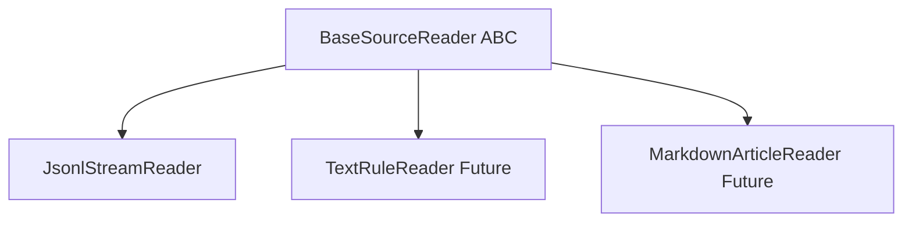

# Milestone 1 Implementation Plan: Abstract Source Reader Interface & JsonlStreamReader Refactoring

## 1. Executive Summary & Objective

Milestone 1 establishes the polymorphic foundation for Phase 2 multi-source ingestion. We introduce the abstract base class [`BaseSourceReader`](../ingestion/readers/base.py) defining a uniform iteration contract (`stream_records`), and refactor [`JsonlStreamReader`](../core/streaming.py) in [`core/streaming.py`](../core/streaming.py) to inherit from it. This ensures all future corpus readers (comprehensive rules, card rulings, strategy articles, and decklists) share a consistent, memory-safe interface.

---

## 2. Architecture & Class Hierarchy



### 2.1 Abstract Base Interface (`ingestion/readers/base.py`)
- **Module**: `ingestion.readers.base`
- **Class**: `BaseSourceReader(ABC)`
- **Methods**:
  - `@abstractmethod def stream_records(self) -> Iterator[Dict[str, Any]]`: Yields raw parsed record dictionaries from any data corpus source.

### 2.2 Refactored JSONL Stream Reader (`core/streaming.py`)
- **Class**: `JsonlStreamReader(BaseSourceReader)`
- **Compatibility**: Retains existing `.stream()` method yielding `Tuple[Dict[str, Any], int]` (`(card_obj, bytes_read)`) for zero-friction integration with existing [`IngestionPipeline`](../ingestion/pipeline.py).
- **Implementation**: Implements `stream_records(self) -> Iterator[Dict[str, Any]]` by delegating to or consuming `.stream()`.

---

## 3. Detailed Implementation Steps

### Step 1: Create Ingestion Readers Package & Base Interface
1. Create directory `ingestion/readers/`.
2. Create `ingestion/readers/__init__.py` (empty or exporting `BaseSourceReader`).
3. Create `ingestion/readers/base.py` with the following content:
   ```python
   from abc import ABC, abstractmethod
   from typing import Iterator, Dict, Any

   class BaseSourceReader(ABC):
       """Abstract base interface for incremental data corpus readers."""
       
       @abstractmethod
       def stream_records(self) -> Iterator[Dict[str, Any]]:
           """Yield raw record dictionaries from the data source."""
           pass
   ```

### Step 2: Refactor `JsonlStreamReader` in `core/streaming.py`
1. Import `BaseSourceReader` from `ingestion.readers.base`.
2. Update class definition: `class JsonlStreamReader(BaseSourceReader):`.
3. Add `stream_records` method to `JsonlStreamReader`:
   ```python
   def stream_records(self) -> Iterator[Dict[str, Any]]:
       """Yield raw record dictionaries from the JSONL file."""
       for record, _ in self.stream():
           yield record
   ```

### Step 3: Implement Comprehensive Unit Tests
1. Create `tests/test_streaming.py` to test:
   - `JsonlStreamReader` inheritance from `BaseSourceReader`.
   - Correctness of `stream_records()` output matching expected card dicts.
   - Line counting and error recovery behavior during malformed JSON decoding.
2. Run test suite to verify backward compatibility with existing tests in [`tests/test_pipeline.py`](../tests/test_pipeline.py).

---

## 4. Acceptance Criteria

1. [`BaseSourceReader`](../ingestion/readers/base.py) is implemented as an abstract base class with `@abstractmethod def stream_records`.
2. [`JsonlStreamReader`](../core/streaming.py) inherits from `BaseSourceReader` and implements `stream_records`.
3. Existing ingestion pipelines ([[`IngestionPipeline`](../ingestion/pipeline.py)]) and tests ([[`TestIngestionPipeline`](../tests/test_pipeline.py)]) pass successfully without modification.
4. New unit tests specifically validate `BaseSourceReader` compliance and `stream_records` iteration.
