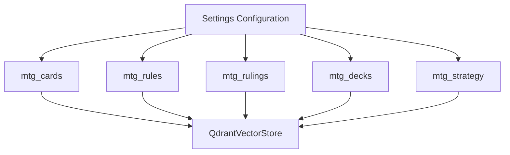

# Milestone 2 Implementation Plan: Multi-Collection Support in Settings & QdrantVectorStore

## 1. Executive Summary & Objective

Milestone 2 establishes multi-collection support across the five core data domains (`mtg_cards`, `mtg_rules`, `mtg_rulings`, `mtg_decks`, `mtg_strategy`) as specified in [`docs/plans/phase_2_implementation_plan.md`](docs/plans/phase_2_implementation_plan.md). This milestone updates [`Settings`](../config/settings.py:7) in [`config/settings.py`](../config/settings.py:1) to configure distinct Qdrant collection names and enhances [`QdrantVectorStore`](../vectorstores/qdrant.py:11) in [`vectorstores/qdrant.py`](../vectorstores/qdrant.py:1) to support target collection routing at both the instance initialization level and method execution level.

---

## 2. Architecture & Design



### 2.1 Settings Expansion (`config/settings.py`)
Add explicit collection configuration attributes to [`Settings`](../config/settings.py:7), supporting environment variable overrides (`QDRANT_COLLECTION_CARDS`, `QDRANT_COLLECTION_RULES`, `QDRANT_COLLECTION_RULINGS`, `QDRANT_COLLECTION_DECKS`, `QDRANT_COLLECTION_STRATEGY`) while maintaining backward compatibility with `qdrant_collection_name`.

### 2.2 QdrantVectorStore Parameterization (`vectorstores/qdrant.py`)
Enhance [`QdrantVectorStore`](../vectorstores/qdrant.py:11) to:
1. Accept any of the collection names during instantiation (`collection_name: str = settings.qdrant_collection_cards`).
2. Accept an optional `collection_name: Optional[str] = None` override parameter on all core methods (`initialize_schema`, `set_bulk_mode`, `upsert_batch`, `get_existing_ids`, `search`), falling back to `self.collection_name` if not provided.

---

## 3. Detailed Implementation Steps

### Step 1: Update `Settings` in `config/settings.py`
1. Open [`config/settings.py`](../config/settings.py).
2. Add the five collection fields with `field(default_factory=lambda: os.getenv(..., "..."))`:
   ```python
   qdrant_collection_cards: str = field(
       default_factory=lambda: os.getenv("QDRANT_COLLECTION_CARDS", "mtg_cards")
   )
   qdrant_collection_rules: str = field(
       default_factory=lambda: os.getenv("QDRANT_COLLECTION_RULES", "mtg_rules")
   )
   qdrant_collection_rulings: str = field(
       default_factory=lambda: os.getenv("QDRANT_COLLECTION_RULINGS", "mtg_rulings")
   )
   qdrant_collection_decks: str = field(
       default_factory=lambda: os.getenv("QDRANT_COLLECTION_DECKS", "mtg_decks")
   )
   qdrant_collection_strategy: str = field(
       default_factory=lambda: os.getenv("QDRANT_COLLECTION_STRATEGY", "mtg_strategy")
   )
   ```
3. Retain `qdrant_collection_name` as an alias or fallback pointing to `qdrant_collection_cards` for backward compatibility.

### Step 2: Update `QdrantVectorStore` in `vectorstores/qdrant.py`
1. Open [`vectorstores/qdrant.py`](../vectorstores/qdrant.py).
2. Update `__init__` to accept `collection_name: str = settings.qdrant_collection_cards`.
3. Update `initialize_schema(self, collection_name: Optional[str] = None) -> None`:
   - Resolve target collection name: `target_col = collection_name or self.collection_name`.
   - Check and create collection `target_col`.
4. Update `set_bulk_mode(self, enabled: bool, collection_name: Optional[str] = None) -> None`:
   - Resolve target collection name: `target_col = collection_name or self.collection_name`.
   - Update collection optimizers config for `target_col`.
5. Update `upsert_batch(self, ids: List[str], vectors: List[List[float]], payloads: List[Dict[str, Any]], collection_name: Optional[str] = None) -> None`:
   - Resolve target collection name: `target_col = collection_name or self.collection_name`.
   - Perform `self.client.upsert(collection_name=target_col, points=points)`.
6. Update `get_existing_ids(self, collection_name: Optional[str] = None) -> Set[str]`:
   - Resolve target collection name: `target_col = collection_name or self.collection_name`.
   - Scroll through `target_col` and collect existing IDs.
7. Update `search(self, query_vector: List[float], limit: int = 10, filters: Optional[Any] = None, candidate_ids: Optional[List[str]] = None, collection_name: Optional[str] = None) -> List[Any]`:
   - Resolve target collection name: `target_col = collection_name or self.collection_name`.
   - Execute `self.client.query_points(collection_name=target_col, ...)` with retry logic.

### Step 3: Implement Unit Tests (`tests/test_settings.py` & `tests/test_qdrant_multicolection.py`)
1. Create `tests/test_settings.py` to verify:
   - Default values for all five collection attributes.
   - Environment variable overriding behavior.
2. Create `tests/test_qdrant_multicolection.py` to verify:
   - `QdrantVectorStore` initialization with explicit and default collection names.
   - Method-level `collection_name` override routing.
   - Backward compatibility with existing single-collection usage.

---

## 4. Acceptance Criteria

1. [`Settings`](../config/settings.py:7) defines `qdrant_collection_cards`, `qdrant_collection_rules`, `qdrant_collection_rulings`, `qdrant_collection_decks`, and `qdrant_collection_strategy` with environment variable fallbacks.
2. [`QdrantVectorStore`](../vectorstores/qdrant.py:11) supports both instance-level and method-level `collection_name` parameters across all vector store operations (`initialize_schema`, `set_bulk_mode`, `upsert_batch`, `get_existing_ids`, `search`).
3. Existing test suites ([[`TestIngestionPipeline`](../tests/test_pipeline.py)]) pass successfully without regression.
4. New unit tests validate multi-collection configuration and routing.
