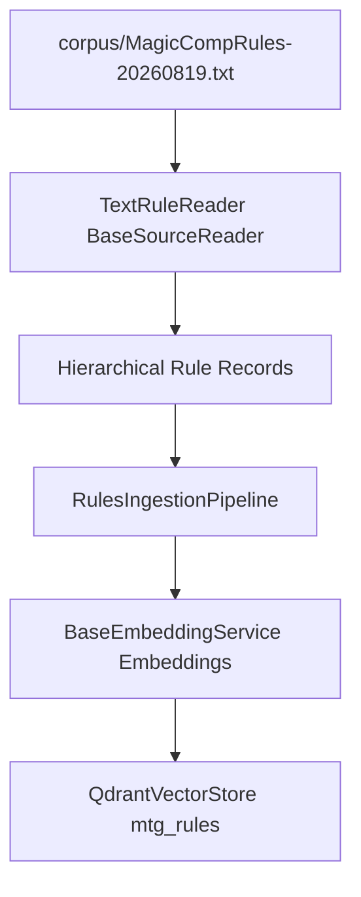

# Milestone 3 Implementation Plan: TextRuleReader & Comprehensive Rules Ingestion Pipeline

## 1. Executive Summary & Objective

Milestone 3 implements the parsing and ingestion pipeline for official Magic: The Gathering comprehensive rules ([`corpus/MagicCompRules-20260819.txt`](../corpus/MagicCompRules-20260819.txt)). Building upon the polymorphic [`BaseSourceReader`](../ingestion/readers/base.py) established in Milestone 1 and multi-collection support (`mtg_rules`) established in Milestone 2, this milestone introduces:
1. **`TextRuleReader`** (`ingestion/readers/rule_reader.py`): A memory-safe stream reader that parses the flat text comprehensive rules file into structured hierarchical records (`rule_id`, `chapter`, `section`, `text`, `hierarchy_path`).
2. **`RulesIngestionPipeline`** (`ingestion/pipelines/rules_pipeline.py`): An ingestion pipeline that embeds comprehensive rules chunks using [`BaseEmbeddingService`](../embeddings/base.py:51) and bulk-upserts them into the [`mtg_rules`](phase_2_implementation_plan.md:18) Qdrant collection.

---

## 2. Architecture & Design



### 2.1 Rule Structure & Parsing Logic
Comprehensive rules files are structured hierarchically:
- **Header/Credits/Glossary**: Ignored or handled gracefully.
- **Chapters**: e.g., `1. Game Concepts`, `2. Parts of a Card`. Detected via lines matching pattern (e.g., `^[0-9]+\.\s+[A-Z].*`).
- **Sections**: e.g., `100. General`, `101. Interaction of Effects`. Detected via lines matching pattern (e.g., `^[0-9]{3}\.\s+.*`).
- **Rules**: e.g., `100.1a Two or more players...`. Detected via line start matching rule identifier pattern (e.g., `^[0-9]{3}\.[0-9]+[a-z]?\s+.*`). Multi-line rules continue until the next rule, section, or chapter header.

#### Output Record Schema:
```python
{
    "rule_id": "100.1a",
    "chapter": "1. Game Concepts",
    "section": "100. General",
    "text": "100.1a Two or more players are required to play a traditional game of Magic.",
    "hierarchy_path": "1. Game Concepts > 100. General > 100.1a"
}
```

---

## 3. Detailed Implementation Steps

### Step 1: Implement `TextRuleReader` (`ingestion/readers/rule_reader.py`)
1. Create `ingestion/readers/rule_reader.py`.
2. Implement `TextRuleReader` inheriting from `BaseSourceReader` ([`ingestion/readers/base.py`](../ingestion/readers/base.py)):
   - Constructor accepts file path (defaulting to [`corpus/MagicCompRules-20260819.txt`](../corpus/MagicCompRules-20260819.txt)).
   - Implement `stream_records(self) -> Iterator[Dict[str, Any]]`:
     - Open file with UTF-8 encoding (handling BOM if present).
     - Track state: `current_chapter`, `current_section`, accumulated rule buffer.
     - Use compiled regular expressions for chapter, section, and rule headers.
     - Yield structured rule dicts as each complete rule is parsed.

### Step 2: Implement Rules Ingestion Pipeline (`ingestion/pipelines/rules_pipeline.py`)
1. Create `ingestion/pipelines/rules_pipeline.py`.
2. Implement `RulesIngestionPipeline`:
   - Dependencies: `TextRuleReader`, `BaseEmbeddingService`, `QdrantVectorStore`, [`Settings`](../config/settings.py:7).
   - Method `run(self, batch_size: int = 100, force_recreate: bool = False) -> None`:
     - Initialize schema for target collection (`settings.qdrant_collection_rules`) using `QdrantVectorStore`.
     - Enable bulk mode (`set_bulk_mode(True, collection_name=settings.qdrant_collection_rules)`).
     - Stream rule records from `TextRuleReader`.
     - Batch rule texts, generate dense vectors via embedding service.
     - Construct Qdrant points with IDs (deterministic UUID generated from `rule_id`), vectors, and payloads (containing `rule_id`, `chapter`, `section`, `text`, `hierarchy_path`).
     - Upsert batch into `mtg_rules`.
     - Restore bulk mode optimizers upon completion.

### Step 3: Implement Unit & Integration Tests
1. Create `tests/test_rule_reader.py`:
   - Test parsing of sample rule text fixture containing chapters, sections, and multi-line rules.
   - Verify correct extraction of `rule_id`, `chapter`, `section`, `text`, and `hierarchy_path`.
2. Create `tests/test_rules_pipeline.py`:
   - Test pipeline execution with mocked reader and embedding service against a test Qdrant store instance.

---

## 4. Acceptance Criteria

1. [`TextRuleReader`](../ingestion/readers/rule_reader.py) inherits from `BaseSourceReader` and correctly streams hierarchical rule records from [`corpus/MagicCompRules-20260819.txt`](../corpus/MagicCompRules-20260819.txt).
2. `RulesIngestionPipeline` successfully initializes schema, embeds, and upserts rules into the `mtg_rules` collection via [`QdrantVectorStore`](../vectorstores/qdrant.py:11).
3. Unit tests in `tests/test_rule_reader.py` and `tests/test_rules_pipeline.py` pass successfully with 100% success rate.
