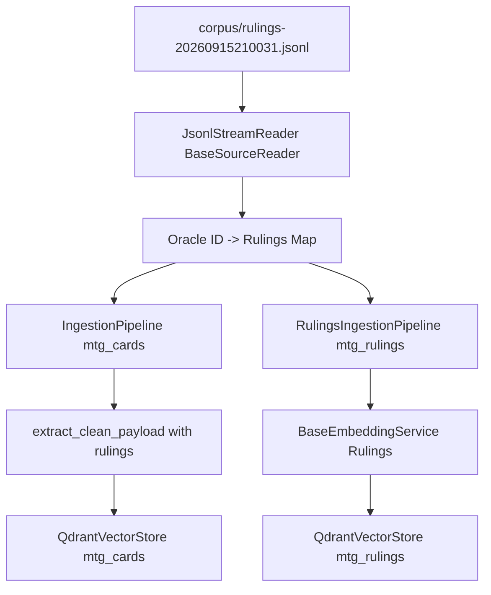

# Milestone 4 Implementation Plan: Card Rulings Pre-Join & Standalone `mtg_rulings` Ingestion Pipeline

## 1. Executive Summary & Objective

Milestone 4 implements the **Dual-Layer Card Rulings Strategy** as defined in [`docs/plans/phase_2_implementation_plan.md`](docs/plans/phase_2_implementation_plan.md). Card rulings from Scryfall (stored in [`corpus/rulings-20260915210031.jsonl`](../corpus/rulings-20260915210031.jsonl)) are utilized in two complementary ways:
1. **Payload Pre-Join (`mtg_cards`)**: Rulings are indexed by `oracle_id` and attached directly to the card's Qdrant payload dictionary under the `"rulings"` attribute via [`extract_clean_payload()`](../embeddings/text_extractors.py:3) in [`embeddings/text_extractors.py`](../embeddings/text_extractors.py:1). This provides instant ruling context upon card retrieval without diluting or distorting the card's core dense embedding vector ([`extract_embedding_text()`](../embeddings/text_extractors.py:40)).
2. **Standalone Rulings Collection (`mtg_rulings`)**: A dedicated ingestion pipeline (`RulingsIngestionPipeline` in [`ingestion/pipelines/rulings_pipeline.py`](../ingestion/pipelines/rulings_pipeline.py)) indexes individual rulings as standalone vectorized points, enabling direct semantic search over rules interactions and edge cases when users query general rules questions without naming specific cards.

---

## 2. Architecture & Design



### 2.1 Rulings Record Structure (`corpus/rulings-20260915210031.jsonl`)
Each line in the rulings JSONL corpus parses into a record dictionary:
```python
{
    "object": "ruling",
    "oracle_id": "00063229-9ba7-4d07-b6e8-1eaec0987766",
    "source": "wotc",
    "published_at": "2004-10-04",
    "comment": "If multiple effects modify when you can cast a spell, apply them in chronological order..."
}
```

### 2.2 Payload Pre-Join Extension (`embeddings/text_extractors.py`)
[`extract_clean_payload()`](../embeddings/text_extractors.py:3) will accept an optional `rulings: Optional[List[Dict[str, Any]]] = None` parameter (defaulting to `[]`), adding `"rulings": rulings or []` to the returned dictionary.

### 2.3 Standalone `RulingsIngestionPipeline` (`ingestion/pipelines/rulings_pipeline.py`)
- **Class**: `RulingsIngestionPipeline`
- **Dependencies**: [`JsonlStreamReader`](../core/streaming.py:116) (inheriting from [`BaseSourceReader`](../ingestion/readers/base.py)), [`BaseEmbeddingService`](../embeddings/base.py:51), [`QdrantVectorStore`](../vectorstores/qdrant.py:11), [`Settings`](../config/settings.py:7).
- **Execution Flow**:
  1. Initialize schema for collection `settings.qdrant_collection_rulings` via [`QdrantVectorStore`](../vectorstores/qdrant.py:11).
  2. Enable bulk mode (`set_bulk_mode(True, collection_name=settings.qdrant_collection_rulings)`).
  3. Fetch existing ruling point IDs for resume capability (`get_existing_ids(collection_name=settings.qdrant_collection_rulings)`).
  4. Stream ruling records via [`JsonlStreamReader`](../core/streaming.py:116).
  5. Format embedding text for each ruling (combining comment or card reference if available).
  6. Generate embeddings in batches, construct deterministic UUIDs (e.g., from `oracle_id` + hash of `comment`), and upsert points into `mtg_rulings`.
  7. Restore bulk mode optimizers upon completion.

---

## 3. Detailed Implementation Steps

### Step 1: Update Payload Extractor in [`embeddings/text_extractors.py`](../embeddings/text_extractors.py:1)
1. Open [`embeddings/text_extractors.py`](../embeddings/text_extractors.py:1).
2. Modify [`extract_clean_payload`](../embeddings/text_extractors.py:3) signature and body:
   ```python
   def extract_clean_payload(card_obj: Dict[str, Any], rulings: Optional[List[Dict[str, Any]]] = None) -> Dict[str, Any]:
       """Extract clean metadata payload fields, including optional pre-joined rulings."""
       payload = {
           # Existing core fields...
       }
       payload["rulings"] = rulings or []
       return payload
   ```

### Step 2: Implement Rulings Indexing Utility & Update Card Pipeline in [`ingestion/pipeline.py`](../ingestion/pipeline.py:1)
1. Create a helper function or method [`load_rulings_index(rulings_file_path: str) -> Dict[str, List[Dict[str, Any]]]`](../ingestion/pipeline.py:1):
   - Streams [`corpus/rulings-20260915210031.jsonl`](../corpus/rulings-20260915210031.jsonl) using [`JsonlStreamReader`](../core/streaming.py:116).
   - Groups rulings by `oracle_id` into a dictionary mapping `oracle_id` -> list of ruling dicts (retaining `source`, `published_at`, `comment`).
2. Update [`IngestionPipeline`](../ingestion/pipeline.py:21) in [`ingestion/pipeline.py`](../ingestion/pipeline.py:1):
   - Accept optional `rulings_file_path: Optional[str] = None`.
   - If provided, load rulings index prior to streaming cards.
   - Pass matching rulings to [`extract_clean_payload(card_obj, rulings=card_rulings)`](../embeddings/text_extractors.py:3).

### Step 3: Implement `RulingsIngestionPipeline` (`ingestion/pipelines/rulings_pipeline.py`)
1. Create directory `ingestion/pipelines/` if not present and create `ingestion/pipelines/rulings_pipeline.py`.
2. Implement `RulingsIngestionPipeline`:
   ```python
   import logging
   from typing import Any, Dict, List, Optional
   from tqdm import tqdm
   
   from config.settings import Settings, settings as default_settings
   from core.streaming import JsonlStreamReader
   from embeddings.base import BaseEmbeddingService
   from vectorstores.base import BaseVectorStore
   
   logger = logging.getLogger(__name__)
   
   class RulingsIngestionPipeline:
       """Pipeline for embedding and ingesting card rulings into the mtg_rulings Qdrant collection."""
       
       def __init__(
           self,
           vector_store: BaseVectorStore,
           embedding_service: BaseEmbeddingService,
           settings: Optional[Settings] = None,
       ) -> None:
           self.vector_store = vector_store
           self.embedding_service = embedding_service
           self.settings = settings or default_settings
           
       def run(self, file_path: str, batch_size: int = 100, force_recreate: bool = False) -> None:
           """Execute standalone rulings ingestion."""
           collection_name = self.settings.qdrant_collection_rulings
           
           logger.info(f"Initializing schema for collection '{collection_name}'...")
           self.vector_store.initialize_schema(collection_name=collection_name)
           
           logger.info(f"Enabling bulk mode for collection '{collection_name}'...")
           self.vector_store.set_bulk_mode(True, collection_name=collection_name)
           
           try:
               logger.info("Fetching existing ruling IDs...")
               existing_ids = self.vector_store.get_existing_ids(collection_name=collection_name)
               
               total_rulings = JsonlStreamReader.count_lines(file_path)
               logger.info(f"Total rulings in source: {total_rulings:,} | Already indexed: {len(existing_ids):,}")
               
               current_texts: List[str] = []
               current_payloads: List[Dict[str, Any]] = []
               current_ids: List[str] = []
               
               reader = JsonlStreamReader(file_path)
               with tqdm(total=total_rulings, desc="Ingesting MTG Rulings", unit="ruling") as pbar:
                   for record, _ in reader.stream():
                       if not isinstance(record, dict):
                           continue
                           
                       oracle_id = record.get("oracle_id", "")
                       comment = record.get("comment", "")
                       published_at = record.get("published_at", "")
                       source = record.get("source", "wotc")
                       
                       if not comment:
                           pbar.update(1)
                           continue
                           
                       # Generate deterministic ID
                       ruling_id = f"{oracle_id}_{hash(comment) & 0xFFFFFFFF:08x}"
                       if ruling_id in existing_ids:
                           pbar.update(1)
                           continue
                           
                       payload = {
                           "oracle_id": oracle_id,
                           "comment": comment,
                           "published_at": published_at,
                           "source": source,
                       }
                       
                       current_texts.append(comment)
                       current_payloads.append(payload)
                       current_ids.append(ruling_id)
                       
                       if len(current_texts) >= batch_size:
                           self._flush_batch(current_texts, current_payloads, current_ids, collection_name)
                           pbar.update(len(current_texts))
                           current_texts, current_payloads, current_ids = [], [], []
                           
                   if current_texts:
                       self._flush_batch(current_texts, current_payloads, current_ids, collection_name)
                       pbar.update(len(current_texts))
                       
           finally:
               logger.info(f"Restoring standard mode for collection '{collection_name}'...")
               self.vector_store.set_bulk_mode(False, collection_name=collection_name)
               
       def _flush_batch(self, texts: List[str], payloads: List[Dict[str, Any]], ids: List[str], collection_name: str) -> None:
           vectors = self.embedding_service.embed_batch(texts)
           self.vector_store.upsert_batch(
               ids=ids,
               vectors=vectors,
               payloads=payloads,
               collection_name=collection_name
           )
   ```

### Step 4: Implement Comprehensive Unit & Integration Tests
1. Create `tests/test_rulings_pipeline.py`:
   - Test rulings index loading from sample JSONL file.
   - Test payload pre-join with `extract_clean_payload()`.
   - Test `RulingsIngestionPipeline` execution with mocked embedding service and vector store against `mtg_rulings`.

---

## 4. Acceptance Criteria

1. [`extract_clean_payload()`](../embeddings/text_extractors.py:3) successfully attaches pre-joined rulings under the `"rulings"` key without altering dense embedding text generation.
2. [`IngestionPipeline`](../ingestion/pipeline.py:21) correctly loads and pre-joins card rulings during card ingestion.
3. `RulingsIngestionPipeline` successfully parses, embeds, and upserts standalone rulings into the [`mtg_rulings`](../docs/plans/phase_2_implementation_plan.md:19) Qdrant collection.
4. Unit and integration tests in `tests/test_rulings_pipeline.py` pass successfully with 100% success rate.
