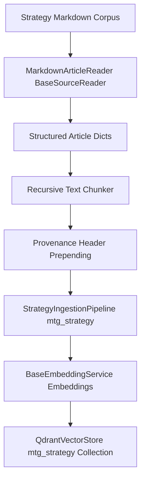

# Milestone 5 Implementation Plan: Strategy Article Ingestion, Recursive Chunking & Provenance Pipeline (`mtg_strategy`)

## 1. Executive Summary & Objective

Milestone 5 implements the ingestion, recursive chunking, and vector embedding pipeline for foundational strategy literature, theory articles, math guides, and advanced gameplay guides targeting the **`mtg_strategy`** Qdrant collection as specified in [`docs/plans/phase_2_implementation_plan.md`](phase_2_implementation_plan.md) and [`docs/plans/phase_2_multi_source_ingestion_research.md`](phase_2_multi_source_ingestion_research.md).

Key capabilities introduced in Milestone 5:
1. **`MarkdownArticleReader`** (`ingestion/readers/markdown_reader.py`): A memory-safe stream reader inheriting from `BaseSourceReader` ([`ingestion/readers/base.py`](../ingestion/readers/base.py)) that parses markdown articles, extracting frontmatter metadata (title, author, source, published date, evergreen status) and body text.
2. **Recursive Chunking & Provenance Header Prepending**: Splits long-form prose into semantically coherent chunks (512–1024 token window with ~10% overlap) and prepends rich provenance headers (`Source | Title | Author | Section Part`) to preserve context during vector retrieval without polluting core semantics.
3. **`StrategyIngestionPipeline`** (`ingestion/pipelines/strategy_pipeline.py`): Orchestrates schema initialization, bulk mode optimization, chunk generation, embedding via [`BaseEmbeddingService`](../embeddings/base.py:51), and deterministic batch upserting into the [`mtg_strategy`](phase_2_implementation_plan.md:21) Qdrant collection.

---

## 2. Architecture & Design



### 2.1 Strategy Article Record Structure
Each markdown source file parses into a structured record dictionary:
```python
{
    "article_id": "math_of_the_gathering_01",
    "title": "The Math of the Gathering: Mana Curves and Probabilities",
    "author": "Frank Karsten",
    "source": "ChannelFireball",
    "published_at": "2020-05-12",
    "evergreen": True,
    "content": "# The Math of the Gathering...\n\n...",
    "tags": ["math", "mana curve", "probability"]
}
```

### 2.2 Recursive Chunking & Provenance Prepending Strategy
- **Chunking Algorithm**: Splits articles recursively using paragraph boundaries (`\n\n`), sentence boundaries, and word boundaries to fit within 512–1024 token target sizes with ~10% overlap.
- **Provenance Header Prepending**:
  ```python
  def format_chunk_for_embedding(article: Dict[str, Any], chunk_text: str, chunk_idx: int) -> str:
      return (
          f"Source: {article.get('source', 'Unknown')} | "
          f"Title: {article.get('title', 'Untitled')} | "
          f"Author: {article.get('author', 'Unknown')} | "
          f"Evergreen: {article.get('evergreen', False)} | "
          f"Section Part {chunk_idx + 1}\n\n"
          f"{chunk_text}"
      )
  ```
- **Deterministic Point IDs**: Generated as UUIDs or deterministic hash strings derived from `article_id` + `chunk_idx`.

---

## 3. Detailed Implementation Steps

### Step 1: Implement `MarkdownArticleReader` (`ingestion/readers/markdown_reader.py`)
1. Create `ingestion/readers/markdown_reader.py`.
2. Implement `MarkdownArticleReader` inheriting from `BaseSourceReader`:
   - Accepts a directory path or file path pattern for markdown strategy articles.
   - Parses YAML frontmatter (using lightweight built-in string parsing or `yaml` if available) for `title`, `author`, `source`, `published_at`, `evergreen`, and `tags`.
   - Yields standardized article dictionaries via `stream_records()`.

### Step 2: Implement Recursive Chunker & Provenance Utilities (`ingestion/chunking.py`)
1. Create `ingestion/chunking.py`.
2. Implement `RecursiveTextChunker`:
   - `chunk_text(text: str, max_chunk_size: int = 1000, overlap: int = 100) -> List[str]`
3. Implement provenance formatting helper function.

### Step 3: Implement `StrategyIngestionPipeline` (`ingestion/pipelines/strategy_pipeline.py`)
1. Create `ingestion/pipelines/strategy_pipeline.py`.
2. Implement `StrategyIngestionPipeline`:
   - **Dependencies**: `MarkdownArticleReader`, `RecursiveTextChunker`, [`BaseEmbeddingService`](../embeddings/base.py:51), [`QdrantVectorStore`](../vectorstores/qdrant.py:11), [`Settings`](../config/settings.py:7).
   - **Execution Flow**:
     1. Initialize schema for collection `settings.qdrant_collection_strategy`.
     2. Enable bulk mode (`set_bulk_mode(True, collection_name=settings.qdrant_collection_strategy)`).
     3. Fetch existing point IDs for incremental resume capability (`get_existing_ids()`).
     4. Stream article records, recursively chunk text, prepend provenance headers, generate embeddings in batches, and upsert points into `mtg_strategy`.
     5. Restore standard mode upon completion.

### Step 4: Implement Unit and Integration Tests (`tests/test_markdown_reader.py`, `tests/test_strategy_pipeline.py`)
1. Create `tests/test_markdown_reader.py` to validate frontmatter parsing and article streaming.
2. Create `tests/test_strategy_pipeline.py` to validate recursive chunking, provenance formatting, and vector store upserting against `mtg_strategy`.

---

## 4. Acceptance Criteria

1. `MarkdownArticleReader` successfully parses markdown frontmatter and body text into standardized article dictionaries conforming to `BaseSourceReader`.
2. `RecursiveTextChunker` produces semantic chunks within configured size limits with proper overlap.
3. Provenance headers are correctly prepended to embedding text without altering payload metadata.
4. `StrategyIngestionPipeline` successfully initializes schema, embeds, and upserts strategy chunks into the `mtg_strategy` Qdrant collection.
5. Unit and integration tests pass successfully with 100% success rate.
