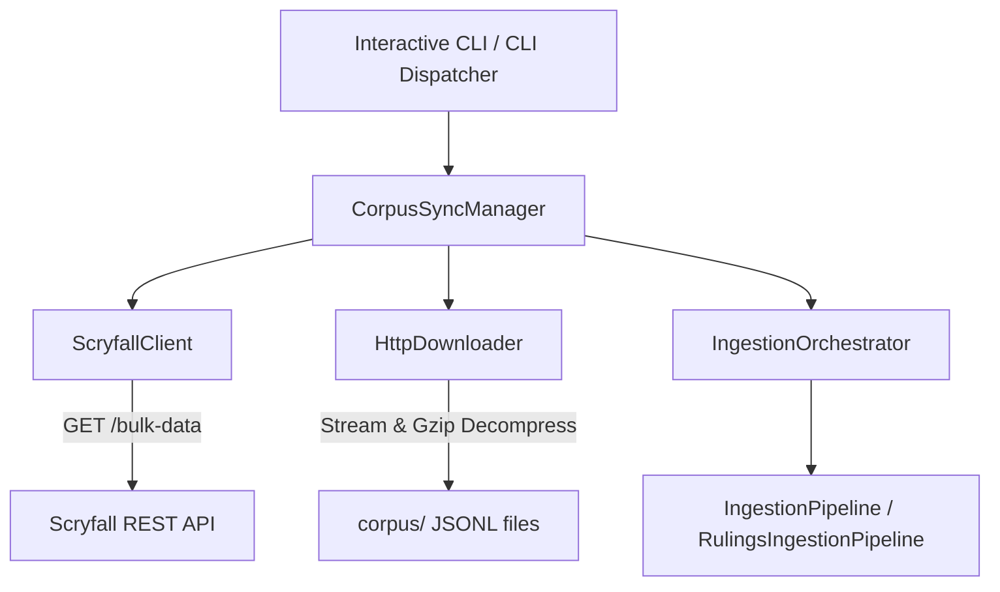

# Comprehensive Implementation Plan: Scryfall API Client & Unified Data Download Subsystem

## 1. Background & Executive Summary

This plan outlines the design and implementation of the **Scryfall API Client and Unified Data Download Subsystem** for [`LexiGrim`](docs/ARCHITECTURE.md:1). The subsystem automates the acquisition, freshness verification, and synchronization of MTG bulk data files (`corpi`) while preserving a strict object-oriented, modular, and provider-agnostic architecture.

Based on [`docs/scryfall_api_documentation.md`](docs/scryfall_api_documentation.md:1) and project rules (`AGENTS.md`), bulk card and rules corpora must be fetched efficiently without memory overhead. The design supports:
1. **Missing Corpus Detection (Goal A)**: Automatic downloading of required corpora (`oracle_cards`, `rulings`, `oracle_tags`) when none exist locally.
2. **Freshness & Update Verification (Goal B)**: Comparing remote `updated_at` timestamps from [`ScryfallClient`](ingestion/sources/scryfall.py:1) against local manifest records (`corpus/.manifest.json`) to prevent redundant downloads while ensuring stale corpora are updated.
3. **Unified Downloading & Loading Bar Integration**: Agnostic stream downloading with live progress reporting compatible with [`LexiGrimSession`](ui/controller.py:9) ([`ui/controller.py`](ui/controller.py:1)) and [`InteractiveCLIShell`](ui/cli/app.py:18) ([`ui/cli/app.py`](ui/cli/app.py:1)).
4. **Deferred Oracle Tag Integration**: Stub/no-op implementation for `oracle_tags` with explicit TODO annotations.

---

## 2. Detailed Requirements & Scryfall API Specifications

From [`docs/scryfall_api_documentation.md`](docs/scryfall_api_documentation.md:1):
- **Bulk Data Catalog Endpoint**: `GET https://api.scryfall.com/bulk-data` returns bulk descriptor objects containing `id`, `type`, `updated_at`, `uri`, `name`, `description`, `jsonl_download_uri`, and `compressed_size` ([`docs/scryfall_api_documentation.md:100-112`](docs/scryfall_api_documentation.md:100)).
- **Required Headers**: `User-Agent` (e.g., `LexiGrim/1.0`) and `Accept: application/json` must be explicitly set on all requests to `api.scryfall.com` ([`docs/scryfall_api_documentation.md:26-33`](docs/scryfall_api_documentation.md:26)).
- **Rate Limits & Origins**: Metadata queries on `api.scryfall.com` are rate-limited (10 req/s general), whereas direct file downloads on `data.scryfall.io` are un-rate-limited gzipped JSONL archives (`.jsonl.gz`) ([`docs/scryfall_api_documentation.md:36-45`](docs/scryfall_api_documentation.md:36)).

---

## 3. Modular Architecture & Package Layout (`ingestion/sources/`)

Per project rules, raw data directories (`data/`, `corpus/`) are reserved for storage artifacts and must not contain Python modules. The acquisition subsystem is housed within [`ingestion/sources/`](ingestion/sources/):



### 3.1 Agnostic Base Interfaces ([`ingestion/sources/base.py`](ingestion/sources/base.py:1))
- **`BulkMetadata`**: Dataclass holding dataset metadata (`name`, `bulk_type`, `download_url`, `updated_at`, `compressed_size_bytes`, `file_format`).
- **`BaseDownloader`**: Abstract interface for HTTP streams:
  - `download_file(url: str, destination_path: str, decompress_gzip: bool = True, progress_callback: Optional[Callable[[float, str, str], None]] = None) -> str`
- **`BaseDataProvider`**: Abstract interface for database/API endpoints:
  - `get_available_bulk_metadata() -> Dict[str, BulkMetadata]`
  - `get_bulk_metadata(bulk_type: str) -> Optional[BulkMetadata]`
  - `fetch_item_by_id(item_id: str) -> Dict[str, Any]`

### 3.2 Agnostic Streaming Downloader ([`ingestion/sources/downloader.py`](ingestion/sources/downloader.py:1))
- Implements [`BaseDownloader`](ingestion/sources/base.py:10).
- Uses chunk buffering ([`Settings.stream_chunk_size`](config/settings.py:64) in [`config/settings.py`](config/settings.py:1)).
- Supports on-the-fly streaming gzip decompression via `zlib.decompressobj()`, outputting plain `.jsonl` directly to disk without storing intermediate `.gz` files.
- Emits progress updates via `progress_callback(percentage: float, speed: str, message: str)` matching [`LexiGrimSession`](ui/controller.py:73).

### 3.3 Concrete Scryfall Provider ([`ingestion/sources/scryfall.py`](ingestion/sources/scryfall.py:1))
- Implements [`BaseDataProvider`](ingestion/sources/base.py:25) for Scryfall.
- Injects required compliance headers (`User-Agent`, `Accept`).
- Throttles requests (100ms interval) and handles HTTP 429 retries with exponential backoff.
- Maps `oracle_cards`, `default_cards`, `all_cards`, `rulings`, and `oracle_tags` into [`BulkMetadata`](ingestion/sources/base.py:1) objects.

### 3.4 Corpus Synchronization Manager ([`ingestion/sources/sync.py`](ingestion/sources/sync.py:1))
- Manages datasets in `corpus/` using a local manifest (`corpus/.manifest.json`):
  - **Goal A (Missing Corpus)**: Automatically downloads required files (`oracle_cards` by default, `rulings`, `oracle_tags`) if absent.
  - **Goal B (Updated Corpus)**: Compares remote `updated_at` with manifest timestamps, downloading updates when available and cleaning up superseded files.

### 3.5 Deferred Oracle Tags Stub Pipeline ([`ingestion/pipelines/oracle_tags_pipeline.py`](ingestion/pipelines/oracle_tags_pipeline.py:1))
- Implements [`OracleTagsIngestionPipeline`](ingestion/pipelines/oracle_tags_pipeline.py:1) as a no-op stub:
  ```python
  class OracleTagsIngestionPipeline:
      """Pipeline stub for ingesting and associating Scryfall Oracle Tags.
      
      NOTE: Full semantic tag ingestion is deferred. This stub provides an interface no-op.
      """
      def run(self, file_path: str, force_recreate: bool = False) -> None:
          # TODO: Implement Oracle Tags parsing and Qdrant payload enrichment
          pass
  ```

---

## 4. Step-by-Step Implementation & Documentation Update Plan

1. **Implement [`ingestion/sources/base.py`](ingestion/sources/base.py:1)**: Define [`BulkMetadata`](ingestion/sources/base.py:1), [`BaseDownloader`](ingestion/sources/base.py:10), and [`BaseDataProvider`](ingestion/sources/base.py:25).
2. **Implement [`ingestion/sources/downloader.py`](ingestion/sources/downloader.py:1)**: Implement [`HttpDownloader`](ingestion/sources/downloader.py:1) with chunked HTTP streaming, streaming gzip decompression, and progress callback telemetry.
3. **Implement [`ingestion/sources/scryfall.py`](ingestion/sources/scryfall.py:1)**: Implement [`ScryfallClient`](ingestion/sources/scryfall.py:1) with Scryfall header compliance, rate limiting, and bulk data parsing.
4. **Implement [`ingestion/sources/sync.py`](ingestion/sources/sync.py:1)**: Implement [`CorpusSyncManager`](ingestion/sources/sync.py:1) for missing corpus detection and timestamp freshness verification.
5. **Implement [`ingestion/pipelines/oracle_tags_pipeline.py`](ingestion/pipelines/oracle_tags_pipeline.py:1)**: Create deferred no-op stub for Oracle Tags ingestion.
6. **Integrate into UI & CLI**: Wire synchronization triggers into [`LexiGrimSession.trigger_background_ingestion()`](ui/controller.py:60) and [`InteractiveCLIShell.handle_user_input()`](ui/cli/app.py:127) for live header progress bars.
7. **Documentation Updates Step**:
   - Update [`docs/ARCHITECTURE.md`](docs/ARCHITECTURE.md:1) to incorporate the [`ingestion/sources/`](ingestion/sources/) acquisition package.
   - Update [`docs/DECISIONS.md`](docs/DECISIONS.md:1) to record decisions regarding agnostic downloader abstractions, direct uncompressed `.jsonl` streaming via `zlib`, and deferred Oracle Tag integration.
   - Update [`docs/CHANGELOG.md`](docs/CHANGELOG.md:1) to document the addition of the Scryfall API client and automated corpus synchronization subsystem.
