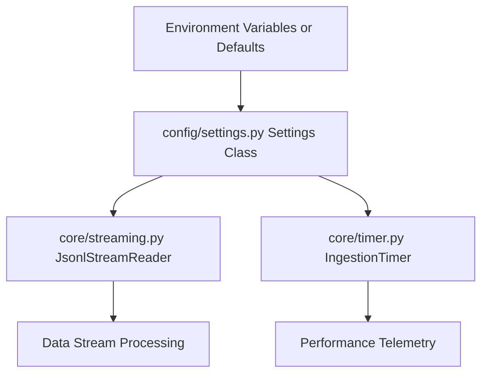

# Phase 1: Foundation, Configuration & Core Utilities Implementation Plan

This implementation plan covers **Phase 1** of the MTG Expert codebase refactor, derived from [`docs/MTG Expert Codebase Comprehensive Code Review.md`](docs/MTG%20Expert%20Codebase%20Comprehensive%20Code%20Review.md:1).

---

## 1. Objectives & Scope

1. **Directory Structure Creation**: Establish the modular architecture layout (`config/`, `core/`, `storage/`, `embeddings/`, `ingestion/`, `search/`, `ai/`, `tests/`).
2. **Centralized Configuration (`config/settings.py`)**: Implement a strongly-typed [`Settings`](config/settings.py:1) dataclass consolidating all constants, environment variables, cross-platform Qdrant binary discovery via [`shutil.which`](config/settings.py:1), and tuning parameters.
3. **Core Memory-Safe Streaming (`core/streaming.py`)**: Consolidate stream reader logic into `JsonlStreamReader` supporting zero-RAM-footprint incremental chunk parsing and robust error recovery.
4. **Core Timer & Telemetry (`core/timer.py`)**: Extract [`IngestionTimer`](core/timer.py:1) with thread-safe [`threading.Lock`](core/timer.py:1) measurements.
5. **Stale Code Removal & Cleanup**: Delete [`card_model.py`](card_model.py) and [`utils/card_dataclass_generator.py`](utils/card_dataclass_generator.py), and clean up [`utils/jsonl_inspector.py`](utils/jsonl_inspector.py).

---

## 2. Architecture & Workflow Diagram



---

## 3. Step-by-Step Implementation Steps

### Step 1: Directory Structure Initialization
Create the following directories in the workspace root:
- [`config/`](config/)
- [`core/`](core/)
- [`storage/`](storage/)
- [`embeddings/`](embeddings/)
- [`ingestion/`](ingestion/)
- [`search/`](search/)
- [`ai/`](ai/)
- [`tests/`](tests/)

### Step 2: Implement Centralized Configuration (`config/settings.py`)
Create [`config/settings.py`](config/settings.py) containing the strongly-typed [`Settings`](config/settings.py:1) dataclass.

#### Exact Code Structure for [`config/settings.py`](config/settings.py)
```python
import os
import shutil
from dataclasses import dataclass, field
from typing import Optional

@dataclass
class Settings:
    # Corpus Path
    data_corpus_path: str = field(
        default_factory=lambda: os.getenv("DATA_CORPUS_PATH", "corpus/default-cards-20260915210531.jsonl")
    )
    
    # Qdrant Executable & Connection Settings
    qdrant_bin: Optional[str] = field(
        default_factory=lambda: os.getenv("QDRANT_BIN") or shutil.which("qdrant")
    )
    qdrant_host: str = field(
        default_factory=lambda: os.getenv("QDRANT_HOST", "localhost")
    )
    qdrant_port: int = field(
        default_factory=lambda: int(os.getenv("QDRANT_PORT", "6333"))
    )
    qdrant_collection_name: str = field(
        default_factory=lambda: os.getenv("QDRANT_COLLECTION_NAME", "mtg_cards")
    )
    
    # FastEmbed Settings
    embedding_model_name: str = field(
        default_factory=lambda: os.getenv("EMBEDDING_MODEL_NAME", "nomic-ai/nomic-embed-text-v1.5")
    )
    fe_threads: int = field(
        default_factory=lambda: int(os.getenv("FE_THREADS", "2"))
    )
    
    # Batch & Queue Sizes
    embedding_batch_size: int = 2
    upsert_batch_size: int = 128
    queue_maxsize: int = 1000
    
    # Indexing Thresholds
    qdrant_indexing_threshold: int = 20000
    qdrant_bulk_indexing_threshold: int = 1000000
    
    # Retry & Backoff
    db_retry_attempts: int = 5
    retry_backoff: float = 0.2
    
    # Stream Chunk Size
    stream_chunk_size: int = 65536
    
    # Search Limits
    search_candidate_pool_limit: int = 10000
    default_display_limit: int = 3

# Global settings singleton instance
settings = Settings()
```

---

### Step 3: Implement Core Memory-Safe Streaming (`core/streaming.py`)
Consolidate [`stream_objects_with_pos()`](ingest.py:68) and robust error handling into `JsonlStreamReader` within [`core/streaming.py`](core/streaming.py).

#### Exact Code Structure for [`core/streaming.py`](core/streaming.py)
```python
import json
from typing import Any, Dict, Generator, Tuple, Optional, List

class JsonlStreamReader:
    """Memory-safe streaming reader for large JSONL datasets using incremental chunk decoding."""
    
    def __init__(self, file_path: str, chunk_size: int = 65536):
        self.file_path = file_path
        self.chunk_size = chunk_size

    def stream(self, skipped_items: Optional[List[Dict[str, Any]]] = None) -> Generator[Tuple[Dict[str, Any], int], None, None]:
        if skipped_items is None:
            skipped_items = []
            
        decoder = json.JSONDecoder()
        buffer = ""
        bytes_read = 0

        with open(self.file_path, "r", encoding="utf-8") as f:
            while True:
                chunk = f.read(self.chunk_size)
                if not chunk:
                    while buffer:
                        buffer = buffer.strip()
                        if not buffer:
                            break
                        try:
                            card_obj, index = decoder.raw_decode(buffer)
                            yield card_obj, bytes_read
                            buffer = buffer[index:]
                        except json.JSONDecodeError as e:
                            skipped_items.append({"buffer": buffer, "error": str(e)})
                            newline_idx = buffer.find("\n")
                            if newline_idx != -1:
                                buffer = buffer[newline_idx + 1:]
                            else:
                                break
                    break

                bytes_read = f.tell()
                buffer += chunk

                while buffer:
                    buffer = buffer.strip()
                    if not buffer:
                        break
                    try:
                        card_obj, index = decoder.raw_decode(buffer)
                        yield card_obj, bytes_read
                        buffer = buffer[index:]
                    except json.JSONDecodeError as e:
                        newline_idx = buffer.find("\n")
                        if newline_idx != -1:
                            bad_line = buffer[:newline_idx]
                            skipped_items.append({"line": bad_line, "error": str(e)})
                            buffer = buffer[newline_idx + 1:]
                        else:
                            break
```

---

### Step 4: Implement Core Timer & Telemetry (`core/timer.py`)
Extract [`IngestionTimer`](ingest.py:33) into [`core/timer.py`](core/timer.py) with clean thread safety using [`threading.Lock`](core/timer.py:1).

#### Exact Code Structure for [`core/timer.py`](core/timer.py)
```python
import time
import threading
from collections import defaultdict
from contextlib import contextmanager
from typing import Dict, Generator

class IngestionTimer:
    """Thread-safe performance telemetry and measurement timer."""
    
    def __init__(self):
        self.timings = defaultdict(float)
        self.counts = defaultdict(int)
        self.lock = threading.Lock()

    @contextmanager
    def measure(self, name: str) -> Generator[None, None, None]:
        start = time.perf_counter()
        try:
            yield
        finally:
            elapsed = time.perf_counter() - start
            with self.lock:
                self.timings[name] += elapsed
                self.counts[name] += 1

    def get_avg(self, name: str) -> float:
        with self.lock:
            count = self.counts[name]
            return self.timings[name] / count if count > 0 else 0.0

    def report(self, printer=print):
        printer("\n=== Pipeline Performance Report ===")
        with self.lock:
            total_time = sum(self.timings.values())
            timings_snapshot = dict(self.timings)
            counts_snapshot = dict(self.counts)
        for name, duration in sorted(timings_snapshot.items(), key=lambda x: x[1], reverse=True):
            count = counts_snapshot[name]
            avg = duration / count if count > 0 else 0
            pct = (duration / total_time * 100) if total_time > 0 else 0
            printer(f"  - {name}: {duration:.3f}s total ({count} calls, avg {avg:.4f}s, {pct:.1f}%)")
        printer(f"Total time measured: {total_time:.3f}s\n")
```

---

### Step 5: Stale Code Removal & Inspector Cleanup
1. **Delete Files**:
   - Delete [`card_model.py`](card_model.py)
   - Delete [`utils/card_dataclass_generator.py`](utils/card_dataclass_generator.py)
2. **Clean Up [`utils/jsonl_inspector.py`](utils/jsonl_inspector.py)**:
   - Remove the stray debug line [`print(card_obj["scryfall_set_uri"])`](utils/jsonl_inspector.py:35).
   - Refactor [`utils/jsonl_inspector.py`](utils/jsonl_inspector.py) to import `JsonlStreamReader` from [`core/streaming.py`](core/streaming.py).

---

## 4. Verification & Acceptance Criteria
- [`config/settings.py`](config/settings.py) successfully exposes all specified constants with environment variable overrides.
- [`core/streaming.py`](core/streaming.py) successfully streams dataset records without RAM spikes.
- [`core/timer.py`](core/timer.py) provides thread-safe telemetry reporting.
- [`card_model.py`](card_model.py) and [`utils/card_dataclass_generator.py`](utils/card_dataclass_generator.py) are fully removed.
- [`utils/jsonl_inspector.py`](utils/jsonl_inspector.py) uses `JsonlStreamReader` and has no stray prints.
